# WITNESS

## Executable Evidence for Failure-Oriented Engineering Claims

**Independent Technical Monograph · Version 1.0 · August 2026**

> **Status.** This is an independent engineering monograph, not a university dissertation, peer-reviewed publication, or claim that an academic degree has been awarded. No ACM badge or independent reproduction status is claimed.

[Run WITNESS](https://asp53826.github.io/witness/) · [Download the designed PDF](../public/publications/WITNESS-Technical-Monograph.pdf) · [Download the Word edition](WITNESS-Technical-Monograph.docx)

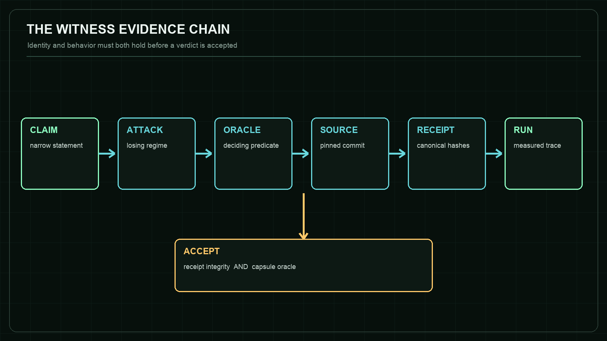

## Abstract

WITNESS is a browser-native reproducibility chamber for engineering claims. Instead of presenting screenshots or aggregate claims, it verifies a canonical failure receipt, binds that receipt to an immutable source revision, executes a bounded adversarial scenario, evaluates an explicit oracle, and emits a local run receipt whose attestation boundary is stated rather than implied.

This monograph develops the evidence model behind WITNESS and analyzes eight executable capsules spanning distributed systems, compiler validation, multi-target tracking, market microstructure, approximate nearest-neighbor search, synthetic-aperture radar autofocus, visual-inertial navigation, and algorithmic differentiation. The contribution is not a new theorem shared by all eight domains. It is an engineering method for keeping claims, losing regimes, measurements, source identity, and limitations coupled closely enough that a reader can rerun and challenge them.

All numerical observations reported here were reproduced in the browser against the pinned WITNESS build described in the artifact manifest. They are targeted counterexamples, not substitutes for full benchmark suites or independent external replication.

## Artifact Status and Claim Boundary

This is an independent technical monograph, not a university dissertation, peer-reviewed publication, or claim that an academic degree has been awarded. The level of treatment is deliberately research-oriented: formal predicates, adversarial methodology, exact source revisions, negative results, and reproducibility artifacts are included so the work can be evaluated on evidence rather than labels.

The canonical COUNTEREXAMPLE release is provenance-attested. A WITNESS browser run is deterministic and hash-bound but explicitly local-unattested. No ACM badge or independent reproduction status is claimed. Section 15 maps the current artifacts to evaluation criteria without awarding them to itself.

## Contents

- 1. Research Problem and Contribution
- 2. Evidence Model
- 3. Threat Model
- 4. Architecture and Runtime Isolation
- 5. Experimental Method
- 6. Distributed Systems: Raft + MVCC
- 7. ML Compiler: TensorForge
- 8. Autonomy: Track Fusion
- 9. Market Microstructure: Limit Order Book Market Making
- 10. Vector Search: ANNLite HNSW
- 11. SAR Imaging: Phase Gradient Autofocus
- 12. Visual-Inertial Navigation: MSCKF VIO
- 13. Numerical Differentiation: AAD Greeks
- 14. Cross-Capsule Synthesis
- 15. Artifact Evaluation Readiness
- 16. Limitations
- 17. Future Work
- 18. Conclusion
- Appendix A. Reproduction Protocol
- Appendix B. Capsule Identity Register
- References

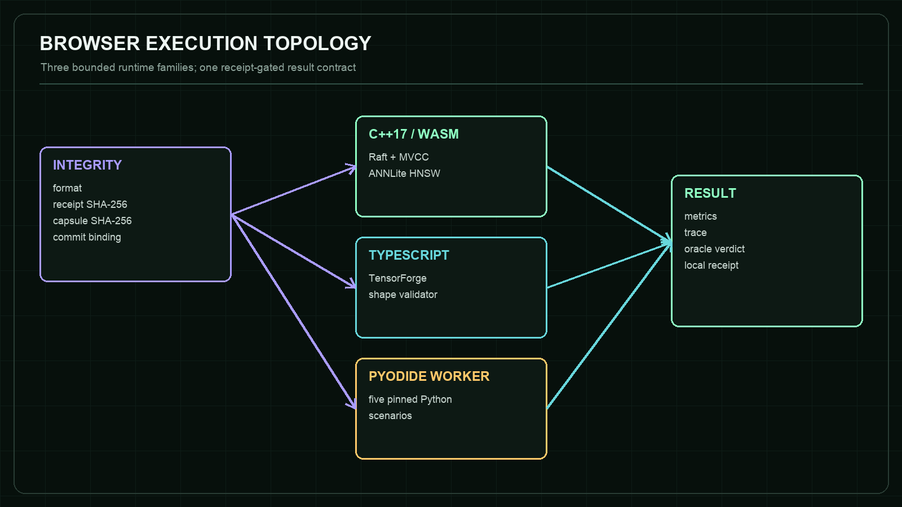

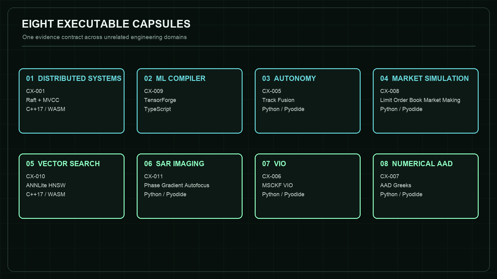

## 1. Research Problem and Contribution

Engineering portfolios often collapse several distinct propositions into one visual claim: that code exists, that it ran, that a reported number came from that code, that the number supports the stated conclusion, and that the conclusion remains valid outside the demonstrated regime. WITNESS separates those propositions and exposes the joins between them.

The working research question is: how can a public engineering artifact make a narrow claim executable, falsifiable, source-bound, and limitation-aware without requiring a reviewer to reconstruct the author's entire environment? The design response is a small verification protocol whose output is useful even when the expected result is a failure.

The first contribution is a receipt-gated execution model. Every capsule names a claim, adversarial condition, oracle, source commit, and canonical receipt digest. Runtime execution is blocked if format, receipt hash, embedded capsule hash, or commit binding fails.

The second contribution is negative-result centricity. A capsule is not a product demo with an error state added later. It begins from a losing regime: minority acceptance without commitment, low-budget recall loss, clutter promotion, entropy/resolution disagreement, missing parallax, or a derivative that is exactly computed and still wrong.

The third contribution is a browser-local review surface. C++ engines compile to WebAssembly; Python engines execute in a module Worker through Pyodide; TypeScript validation runs directly. This reduces installation friction while preserving the distinction between a focused browser scenario and the repository's larger native benchmark suite.

## 2. Evidence Model

Let C be a narrow claim, A an adversarial scenario, O an oracle, S an immutable source revision, R a canonical receipt, and E an observed execution trace. WITNESS accepts a run only if both receipt integrity and behavioral evidence hold.

The integrity predicate is defined as:

```text
I(R,S) = format(R) AND H(canonical(R without receiptSha256)) = R.receiptSha256 AND H(canonical(R.capsule)) = R.integrity.capsuleSha256 AND R.subject.commit = R.capsule.commit = S
```

The behavioral predicate is capsule-specific:

```text
B(E,O) = O(E) = true
```

```text
The chamber verdict is therefore V = I(R,S) AND B(E,O). This decomposition matters: a correct behavioral trace from the wrong revision is not accepted, and a perfectly hashed receipt cannot rescue a failing oracle.
```

The local run receipt records the selected capsule, subject commit, runtime, canonical receipt digest, integrity result, oracle result, timestamp, and a trace digest. It deliberately records signatureStatus=local-unattested. The receipt is evidence of what the visitor's browser observed, not an externally signed release artifact.

## 3. Threat Model

WITNESS is designed against evidence failures that are common in public technical demonstrations: screenshots that cannot be replayed, moving main branches, results detached from commands, stale binaries, silently changed oracles, favorable metrics that hide a losing dimension, and deterministic claims built on unrecorded random state.

The chamber does not defend against a malicious hosting origin, a compromised browser, fabricated upstream repositories, or a coordinated author who falsifies every layer consistently. It also does not transform self-reproduction into independent replication. Those limits are explicit because a threat model that claims everything protects nothing.

The invert-verdict control is a small tamper experiment. It leaves engine output unchanged while negating the expected oracle comparison. The resulting failed trace demonstrates that WITNESS is not merely painting a success state after execution.

## 4. Architecture and Runtime Isolation

The page has three trust-relevant layers. The integrity inspector fetches and verifies the canonical receipt. The execution adapter loads one of three bounded runtime families. The presentation layer renders measured metrics and trace lines from the returned structured result.

C++ capsules use modularized Emscripten output and pre-fetched WebAssembly bytes. TensorForge uses the pinned validator directly in TypeScript. Five Python capsules run in one module Worker. The Worker mounts only enumerated pinned source files and selects only hard-coded scenarios; visitors cannot submit arbitrary Python.

Worker isolation is a responsiveness boundary, not a security sandbox claim. It prevents scientific Python computations from blocking the main UI and keeps the DOM outside the worker global context. The hosting origin still controls both sides of the message channel.

## 5. Experimental Method

Each capsule is constructed as a minimal discriminating experiment. One variable or regime is attacked, the random state is fixed where relevant, and the oracle observes the state necessary to distinguish the intended invariant from an unrelated failure.

Results in this document are browser observations from the pinned scenarios, not copied headline numbers from repository READMEs. Where the browser intentionally uses a smaller dataset than a native benchmark, that difference is named in the capsule boundary.

The method favors exact paired comparisons and identities over broad but weak scores: commit index beside local append, dispatch count beside a shape exception, exact brute-force neighbors beside approximate search, entropy beside impulse-response width, dead reckoning beside VIO in a no-parallax regime, and analytic/bumped/smoothed deltas beside pathwise AAD.

## 6. Distributed Systems: Raft + MVCC

> **CX-001 · C++17 to WebAssembly**  
> A command appended by a minority leader cannot become committed or visible without majority acknowledgement.

| Field | Value |
|---|---|
| Repository | asp53826/raft-mvcc |
| Pinned commit | `a5dd0986756b26ff5f375b73d03d618d9b2aded0` |
| Receipt SHA-256 | `57c9cc96b82129672391606b85b45a8b3cdd9f32588a3df22bb841fd78890313` |
| Adversarial scenario | Elect node 1, isolate it from four peers, and submit transaction 7 to the stale leader. |
| Oracle | The isolated log grows locally, but commit index and every MVCC state digest remain unchanged. |
| Browser observation | Local log 1 to 2; commit index 1 to 1; four messages dropped; visible value: none. |

### Mechanism and interpretation

The distinction between acceptance and commitment is the center of this capsule. A client-facing append can look successful even though the replicated state machine has not crossed the majority boundary. WITNESS therefore observes the private log, commit index, follower logs, and state visibility separately instead of collapsing them into one success flag.

The failure injection is intentionally minimal: one bidirectional partition and one proposal. That narrow trace makes the oracle inspectable. The result is evidence for the majority-before-commit invariant at the pinned revision, not evidence that every Raft implementation or every storage layer is correct.

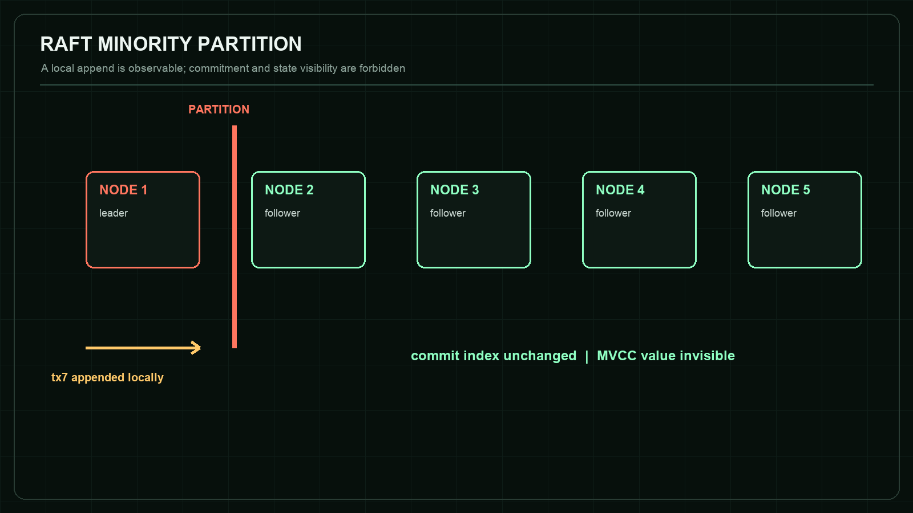

### Claim boundary

The deterministic transport models exact partitions. It does not reproduce TCP backoff, kernel scheduling, disk faults, or fsync latency.

**Reproduce:** https://asp53826.github.io/witness/?capsule=systems

## 7. ML Compiler: TensorForge

> **CX-009 · TypeScript**  
> Matrix multiplication must reject unequal contracting dimensions before optimization or GPU dispatch.

| Field | Value |
|---|---|
| Repository | asp53826/tensorforge-webgpu |
| Pinned commit | `70a5c855ef35e01a29ba351eb2645670060b9f0b` |
| Receipt SHA-256 | `37576d77588845f3023d2debcb397f53eacfb91cdca94250f1013c1f778eefa6` |
| Adversarial scenario | Mutate W1 from [128,256] to [127,256] while retaining the upstream [8,128] activation. |
| Oracle | The validator emits the exact shape error and the GPU dispatch counter remains zero. |
| Browser observation | Input [8,128]; W1 [128,256] to [127,256]; GPU dispatches 0; rejection exact. |

### Mechanism and interpretation

Compiler correctness begins before optimization. If malformed tensor programs reach fusion or code generation, later passes can transform the symptom and make the root cause harder to identify. The capsule makes validation a front-door invariant and records that no GPU work was launched.

The oracle is stronger than checking for any exception. It binds the expected mismatch to the contracting dimension and separately observes dispatch count. This prevents an unrelated runtime failure from being misreported as successful shape verification.

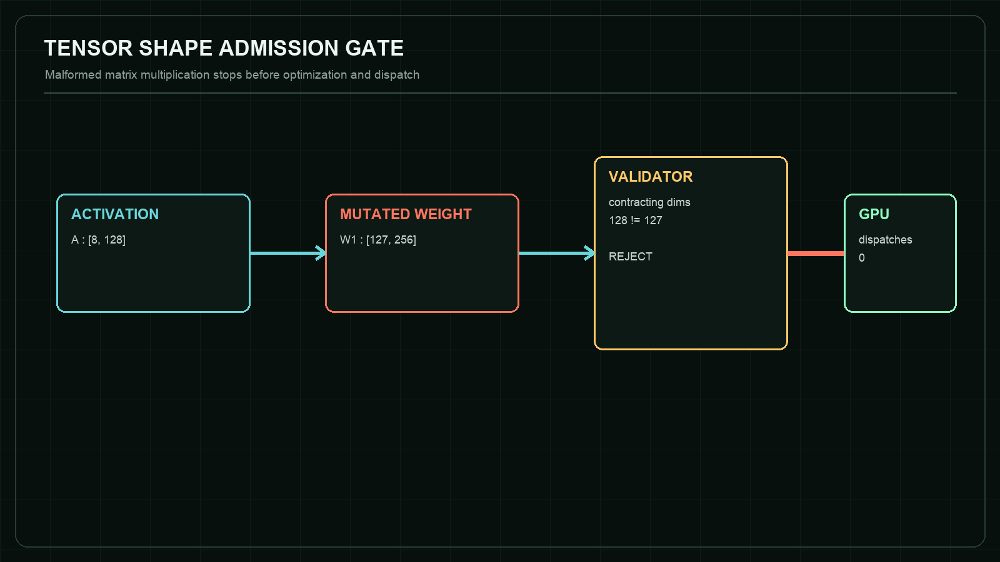

### Claim boundary

This is a static rank-and-dimension guard. It does not establish numerical stability, WebGPU driver correctness, or performance portability.

**Reproduce:** https://asp53826.github.io/witness/?capsule=ml

## 8. Autonomy: Track Fusion

> **CX-005 · Python, NumPy, and SciPy in a Pyodide Worker**  
> Target-free Poisson clutter must not be promoted into persistent confirmed tracks.

| Field | Value |
|---|---|
| Repository | asp53826/track-fusion |
| Pinned commit | `9a1092b8da88f5904ca190a393d77bd2bcd111b8` |
| Receipt SHA-256 | `762231d01fdd53b48b8b958f22cc06b03476b5f3997246a6aa84168eaf29038d` |
| Adversarial scenario | Replay 40 seeded scans with zero targets and an expected six uniform false alarms per scan. |
| Oracle | Wald sequential log-likelihood promotion produces no more than four confirmations. |
| Browser observation | 40 scans; 264 clutter returns; 0 confirmed tracks; acceptance boundary <= 4. |

### Mechanism and interpretation

A large validation gate can collect enough clutter to resemble persistence unless confirmation evidence accounts for both target likelihood and false-alarm density. The capsule attacks this failure directly by removing real targets from the scene.

Zero confirmations is not presented as a universal false-track rate. It is one seeded observation under a published target-free model. The receipt preserves the seed, scan count, clutter density, and acceptance threshold so the evidence can be replayed without being generalized beyond its regime.

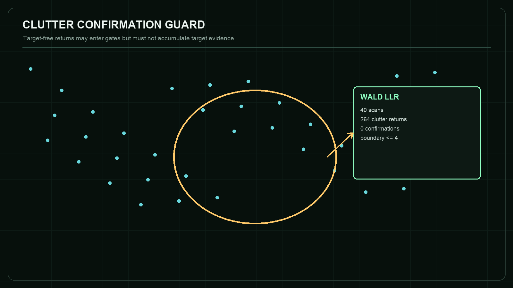

### Claim boundary

The scenario uses simulated planar measurements and a declared clutter model, not calibrated production radar or EO sensor data.

**Reproduce:** https://asp53826.github.io/witness/?capsule=autonomy

## 9. Market Microstructure: Limit Order Book Market Making

> **CX-008 · Python in a Pyodide Worker**  
> A profitability report must keep carried inventory risk and exact P&L decomposition beside total profit.

| Field | Value |
|---|---|
| Repository | asp53826/lob-market-making |
| Pinned commit | `82c75a1fd7824dd96bdb92432b58b3557cb7d577` |
| Receipt SHA-256 | `fa02f77611c71febb1d064c94e534db375104fd8998a39e5aee6d78d0d6e0cba` |
| Adversarial scenario | Run paired 4,000-step simulations at seed 3 with naive and inventory-skew quoting. |
| Oracle | Inventory skew lowers inventory dispersion and both cash/inventory P&L ledgers reconcile exactly. |
| Browser observation | Inventory sigma 33.88 to 11.36; 66.5% reduction; two of two P&L ledgers exact. |

### Mechanism and interpretation

Profit alone is an incomplete state variable. Two strategies can end with similar totals while carrying very different exposure during the run. WITNESS keeps the dispersion of inventory and the accounting identity visible so a favorable total cannot hide a fragile path.

The comparison uses common configuration and seed to reduce irrelevant sampling differences. It still remains a targeted simulator result. No conclusion is drawn about expected live returns, optimal parameter calibration, or market impact.

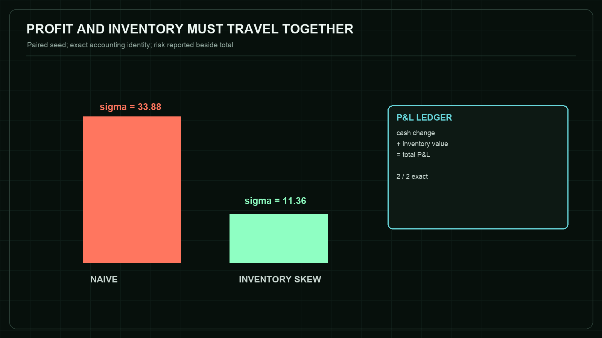

### Claim boundary

This is a synthetic paired test, not a live trading result, execution recommendation, or claim about transaction costs in a real venue.

**Reproduce:** https://asp53826.github.io/witness/?capsule=quant

## 10. Vector Search: ANNLite HNSW

> **CX-010 · C++17 to WebAssembly**  
> Approximate-search speed must be reported with exact-ground-truth recall across the search-work frontier.

| Field | Value |
|---|---|
| Repository | asp53826/annlite |
| Pinned commit | `dc922c8c1816df48d75f2a16e51cd25819aab070` |
| Receipt SHA-256 | `cffc4aa733f3c13b314b666c99304a9fea583558322ed829e6aa83a7f118bf4a` |
| Adversarial scenario | Hold one deterministic 1,800-vector graph and 80 queries fixed while sweeping efSearch from 10 to 100. |
| Oracle | Recall and distance computations must be monotone, and the high-budget endpoint must recover the low-budget misses. |
| Browser observation | Recall 95.375% to 100.000%; mean distance computations 132.97 to 207.91; frontier monotone. |

### Mechanism and interpretation

HNSW exposes a controllable accuracy-cost trade. Reporting only latency creates an incentive to choose a search breadth that looks fast while silently omitting neighbors. The browser capsule computes exact top-10 neighbors first, then measures the approximate result against that oracle.

The observed endpoint reaches full recall on this targeted dataset. That statement is deliberately local: different distributions, graph parameters, dimensions, and insertion orders can change the frontier. The contribution is the executable disclosure pattern, not a claim that efSearch=100 is universally sufficient.

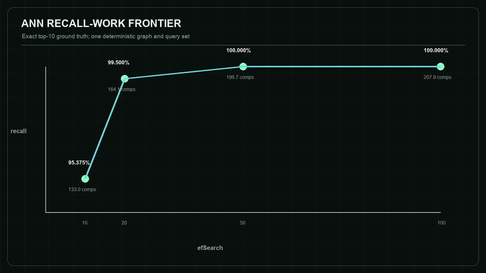

### Claim boundary

This browser-scale graph is not the repository's published SIFT1M throughput benchmark and does not claim production latency.

**Reproduce:** https://asp53826.github.io/witness/?capsule=search

## 11. SAR Imaging: Phase Gradient Autofocus

> **CX-011 · Python and NumPy in a Pyodide Worker**  
> Autofocus acceptance must report both image entropy and impulse-response width.

| Field | Value |
|---|---|
| Repository | asp53826/sar-focus |
| Pinned commit | `83041573ebcfa935640f91cb091e1dbaad4f9aaa` |
| Receipt SHA-256 | `0025d98e9f631c2f487bf3214364a9af6b5987817449e11671fda46404dd9b9e` |
| Adversarial scenario | Inject a seeded random phase error at 5 rad RMS, backproject a four-target scene, and run eight PGA iterations. |
| Oracle | Detect the counterexample in which entropy decreases while azimuth IRW widens. |
| Browser observation | Entropy 10.103 to 9.917; azimuth IRW 0.3096 m to 0.3461 m; recovery 0.89x. |

### Mechanism and interpretation

Autofocus can optimize one scalar while damaging a property that the scalar does not encode. Here the entropy score improves, yet the measured main-lobe width becomes worse. A single-number acceptance test would approve the wrong output.

The capsule treats disagreement as the expected finding. Passing means the system correctly detects the losing regime; it does not mean PGA failed in general. The repository also contains regimes where the same method recovers a known phase error near the diffraction limit.

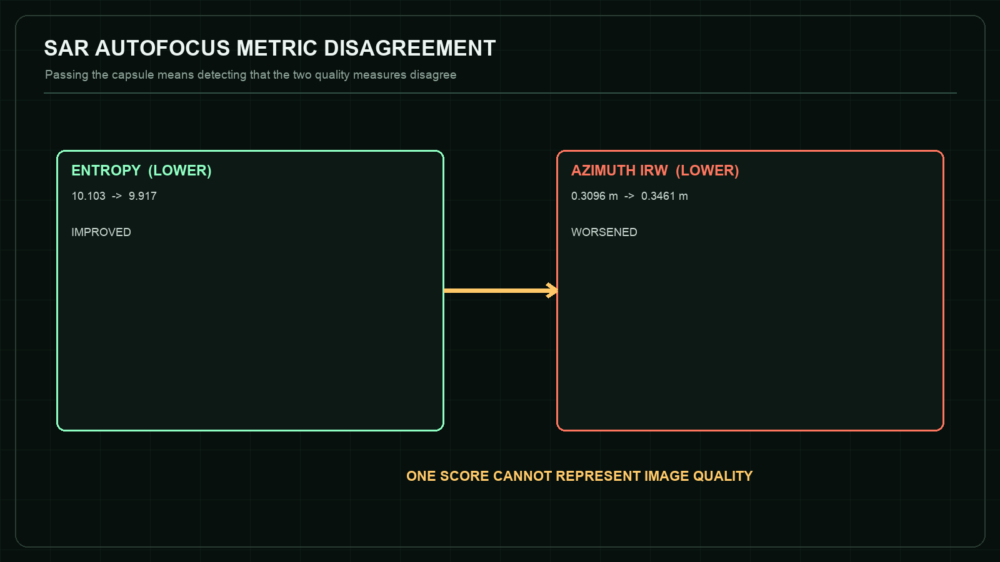

### Claim boundary

The input is a simulated stripmap point-target scene, not flight data or a claim of operational image quality.

**Reproduce:** https://asp53826.github.io/witness/?capsule=imaging

## 12. Visual-Inertial Navigation: MSCKF VIO

> **CX-006 · Python and NumPy in a Pyodide Worker**  
> A stationary camera must reject depth updates that contain no translational parallax.

| Field | Value |
|---|---|
| Repository | asp53826/vio-nav |
| Pinned commit | `f38714f391ffb0dc3ae06b418aae51f929000e1e` |
| Receipt SHA-256 | `be84bcd3f1737f84f292a0169384b6701f537613a847621b19bf55d887a9f37e` |
| Adversarial scenario | Hold the camera in an eight-second synthetic hover with 250 seeded landmarks. |
| Oracle | Reject non-triangulable feature tracks and produce no position correction beyond dead reckoning. |
| Browser observation | 6,956 parallax rejections; dead-reckoning ATE 0.01687 m; VIO ATE 0.01687 m. |

### Mechanism and interpretation

Multiple image observations do not automatically create geometric information. With rotation but no translational baseline, bearing rays do not supply the parallax required for stable depth triangulation. Updating anyway would manufacture structure from an unobservable direction.

The equal ATE values are therefore a feature of this test: the camera provides no valid translational correction. The stronger claim is that the filter recognizes the missing information and refuses to invent it.

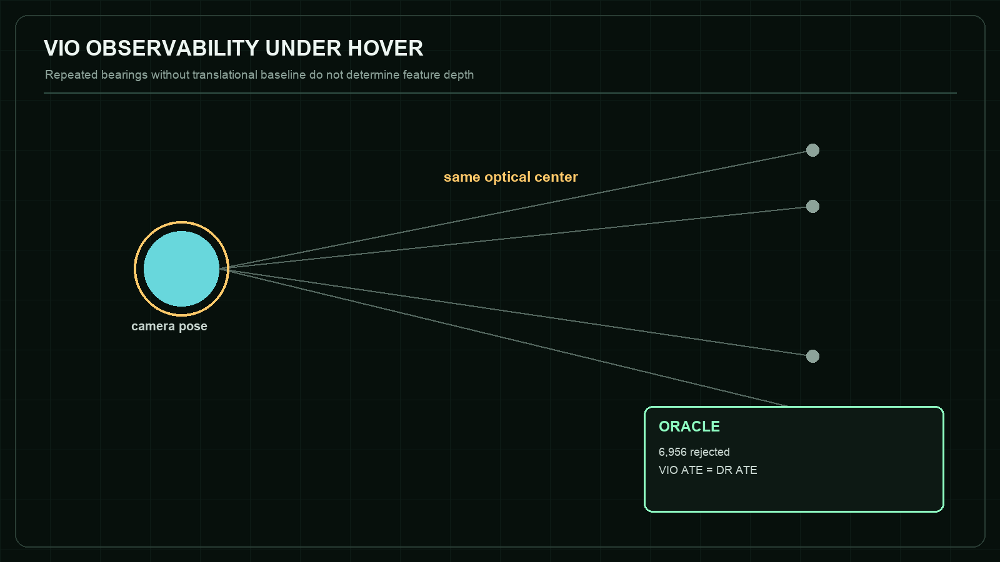

### Claim boundary

The result demonstrates one observability guard in simulation; it is not evidence of field navigation accuracy or full estimator consistency.

**Reproduce:** https://asp53826.github.io/witness/?capsule=navigation

## 13. Numerical Differentiation: AAD Greeks

> **CX-007 · Python and NumPy in a Pyodide Worker**  
> A discontinuous payoff cannot rely on pathwise automatic differentiation without an independent oracle.

| Field | Value |
|---|---|
| Repository | asp53826/aad-greeks |
| Pinned commit | `c26ef7aa18f473b7cfd85642a62aef3a17b94c58` |
| Receipt SHA-256 | `d2d00e9583dfd3f7e7674985b8955cda352818e4a068299749e95cb97e75e4a3` |
| Adversarial scenario | Differentiate a 200,000-path digital payoff at the strike using identical seeded normal draws. |
| Oracle | Compare sharp pathwise AAD with analytic delta, common-random-number central difference, and smoothed AAD. |
| Browser observation | Pathwise AAD 0.000000; analytic 0.019333; central difference 0.019220; smoothed AAD 0.019479. |

### Mechanism and interpretation

The program derivative is exact for almost every simulated path: the derivative of the step payoff is zero away from the strike. The estimator is nevertheless wrong for the derivative of the expectation because differentiation and expectation cannot be interchanged naively at the discontinuity.

The important behavior is silent confidence. No NaN or exception announces the failure. WITNESS therefore makes three independent estimates visible and accepts the capsule only when the false zero and both recovery methods appear together.

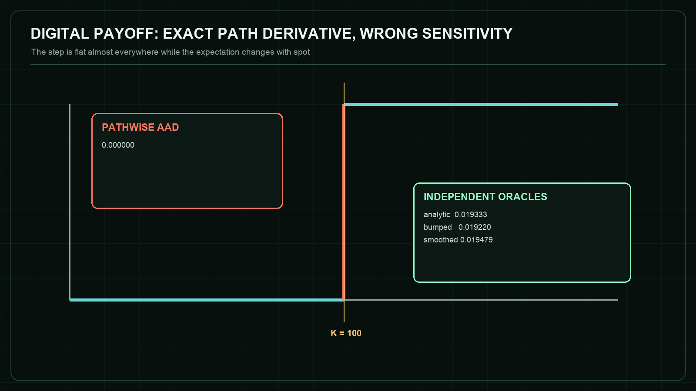

### Claim boundary

This is a numerical counterexample for one digital payoff, not financial advice or validation of a production pricing library.

**Reproduce:** https://asp53826.github.io/witness/?capsule=numerical

## 14. Cross-Capsule Synthesis

Across the eight domains, the same structural failure appears repeatedly: an available measurement is mistaken for the property that actually matters. Local append is mistaken for commitment. Low latency is mistaken for adequate recall. Lower entropy is mistaken for better resolution. A formally propagated derivative is mistaken for the derivative of an expectation. WITNESS counters these substitutions by making the missing companion variable part of the oracle.

The capsules also show three distinct oracle classes. State invariants inspect forbidden transitions, as in Raft and TensorForge. Comparative oracles hold an environment fixed and compare paired methods, as in market making and AAD. Observability or disagreement oracles detect when the information required for a conclusion is absent or contradictory, as in VIO and SAR.

No single runtime establishes credibility. The strongest signal is agreement across layers: human-readable claim, adversarial test, machine-checkable oracle, pinned source, canonical hash, deterministic execution, and an explicit boundary. Removing any one layer creates a predictable ambiguity.

## 15. Artifact Evaluation Readiness

ACM artifact guidance distinguishes availability, functional evaluation, reusability, and independently reproduced results. WITNESS can prepare evidence for such review, but it cannot award itself a badge.

Availability: the repositories, source revisions, receipts, and browser chamber are public. Functionality: the CI suite validates eight receipt bindings, unit tests, WebAssembly smoke scenarios, and the production build. Reusability: source manifests, pinned links, runtime boundaries, and one-command checks lower the cost of inspection. Independent reproduction: not yet established; that status requires another person or team to obtain the results.

A credible next step is a blinded external replay packet: a fresh evaluator receives the release bundle and commands, records environment and deviations, reruns a predeclared subset, and publishes an independent report whether the results match or fail.

## 16. Limitations

The browser scenarios are deliberately bounded and should not be confused with full system evaluation. WebAssembly changes the execution environment for the C++ engines. Pyodide uses browser-distributed scientific Python. Timing measurements are excluded because browser, device, thermal, and scheduling conditions are not controlled.

Receipt hashing establishes identity and detects accidental or adversarial mutation relative to the expected digest. It does not prove that the original statement was true, that the source is free of bugs, or that the author did not choose a favorable scenario.

Several domains depend on simulated data. Simulation is valuable because it exposes ground truth and enables deterministic attacks; it is insufficient for claims about deployment realism. Each capsule therefore limits its conclusion to the modeled regime.

The monograph is authored by the same project owner and should be read as technical documentation, not peer review. Its value is that claims and methods are inspectable enough for others to disagree precisely.

## 17. Future Work

Add environment capture to local run receipts: browser engine, WebAssembly feature set, Pyodide build, package versions, device class, and runtime checksum, while avoiding collection of personal identifiers.

Introduce pre-registered scenario suites so a reviewer can run multiple seeds or parameter cells without granting arbitrary-code execution. Aggregate results should retain every cell and never replace the underlying traces.

Publish signed release artifacts for the WITNESS production bundle and its source manifest. GitHub artifact attestations can bind build provenance, but the UI must still distinguish build provenance from independent result reproduction.

Pursue one genuine external artifact review. The most valuable outcome is not a success badge; it is a public report that identifies which capsule could not be reproduced and why.

## 18. Conclusion

WITNESS treats a claim as an executable object with an attack surface, not a sentence decorated by a benchmark. Its eight capsules demonstrate that sophisticated engineering work becomes more credible when the losing regime is easier to find, the oracle is narrower, the source revision is immutable, and the boundary is impossible to miss.

The result is neither a proof of universal correctness nor a replacement for peer review. It is a practical research artifact: one that lets a reader move from assertion to counterexample, from counterexample to code, and from code to a measured verdict without leaving the evidence chain implicit.

## Appendix A. Reproduction Protocol

1. Open a capsule-specific deep link.
2. Verify format, receipt digest, capsule digest, and commit binding.
3. Execute without inverting the expected verdict.
4. Record metrics and trace lines.
5. Download the local run receipt and confirm it is marked local-unattested.
6. Invert the expected verdict and confirm identical engine output yields a failed comparison.
7. Run the repository-native benchmark separately for any performance claim.

## Appendix B. Capsule Identity Register

| Case | Repository | Commit | Receipt SHA-256 |
|---|---|---|---|
| CX-001 | asp53826/raft-mvcc | `a5dd0986756b26ff5f375b73d03d618d9b2aded0` | `57c9cc96b82129672391606b85b45a8b3cdd9f32588a3df22bb841fd78890313` |
| CX-009 | asp53826/tensorforge-webgpu | `70a5c855ef35e01a29ba351eb2645670060b9f0b` | `37576d77588845f3023d2debcb397f53eacfb91cdca94250f1013c1f778eefa6` |
| CX-005 | asp53826/track-fusion | `9a1092b8da88f5904ca190a393d77bd2bcd111b8` | `762231d01fdd53b48b8b958f22cc06b03476b5f3997246a6aa84168eaf29038d` |
| CX-008 | asp53826/lob-market-making | `82c75a1fd7824dd96bdb92432b58b3557cb7d577` | `fa02f77611c71febb1d064c94e534db375104fd8998a39e5aee6d78d0d6e0cba` |
| CX-010 | asp53826/annlite | `dc922c8c1816df48d75f2a16e51cd25819aab070` | `cffc4aa733f3c13b314b666c99304a9fea583558322ed829e6aa83a7f118bf4a` |
| CX-011 | asp53826/sar-focus | `83041573ebcfa935640f91cb091e1dbaad4f9aaa` | `0025d98e9f631c2f487bf3214364a9af6b5987817449e11671fda46404dd9b9e` |
| CX-006 | asp53826/vio-nav | `f38714f391ffb0dc3ae06b418aae51f929000e1e` | `be84bcd3f1737f84f292a0169384b6701f537613a847621b19bf55d887a9f37e` |
| CX-007 | asp53826/aad-greeks | `c26ef7aa18f473b7cfd85642a62aef3a17b94c58` | `d2d00e9583dfd3f7e7674985b8955cda352818e4a068299749e95cb97e75e4a3` |

## References

1. Association for Computing Machinery. Artifact Review and Badging. https://www.acm.org/publications/policies/artifact-review-and-badging-current
2. Ongaro, D., and Ousterhout, J. In Search of an Understandable Consensus Algorithm (Extended Version). 2014. https://web.stanford.edu/~ouster/cgi-bin/papers/raft-extended.pdf
3. Herlihy, M. P., and Wing, J. M. Linearizability: A Correctness Condition for Concurrent Objects. ACM TOPLAS 12(3), 1990. https://doi.org/10.1145/78969.78972
4. Malkov, Y. A., and Yashunin, D. A. Efficient and Robust Approximate Nearest Neighbor Search Using Hierarchical Navigable Small World Graphs. IEEE TPAMI 42(4), 2020. https://arxiv.org/abs/1603.09320
5. Mourikis, A. I., and Roumeliotis, S. I. A Multi-State Constraint Kalman Filter for Vision-aided Inertial Navigation. ICRA, 2007. https://www-users.cse.umn.edu/~stergios/papers/ICRA07-MSCKF.pdf
6. Wahl, D. E., Eichel, P. H., Ghiglia, D. C., and Jakowatz, C. V. Phase Gradient Autofocus - A Robust Tool for High Resolution SAR Phase Correction. IEEE TAES 30(3), 1994. https://doi.org/10.1109/7.303752
7. Fortmann, T. E., Bar-Shalom, Y., and Scheffe, M. Sonar Tracking of Multiple Targets Using Joint Probabilistic Data Association. IEEE Journal of Oceanic Engineering 8(3), 1983. https://doi.org/10.1109/JOE.1983.1145560
8. Avellaneda, M., and Stoikov, S. High-frequency Trading in a Limit Order Book. Quantitative Finance 8(3), 2008. https://doi.org/10.1080/14697680701381228
9. Giles, M. B. Fifteen Years of Adjoint Algorithmic Differentiation in Finance. 2024. https://www2.maths.ox.ac.uk/~gilesm/files/AAD_Review.pdf
10. LLVM Project. MLIR Shape Inference. https://mlir.llvm.org/docs/ShapeInference/
11. Emscripten Project. WebAssembly and Modularized Output Documentation. https://emscripten.org/docs/compiling/WebAssembly.html
12. Pyodide Project. Using Pyodide in a Web Worker, version 314.0.2. https://pyodide.org/en/stable/usage/webworker.html
13. GitHub. Using Artifact Attestations to Establish Provenance for Builds. https://docs.github.com/en/actions/how-tos/secure-your-work/use-artifact-attestations/use-artifact-attestations
14. Patel, A. WITNESS source repository, pinned capsule definitions, tests, and source manifest. https://github.com/asp53826/witness
15. Patel, A. COUNTEREXAMPLE v1.0.0 release and canonical failure receipts. https://github.com/asp53826/counterexample/releases/tag/v1.0.0
